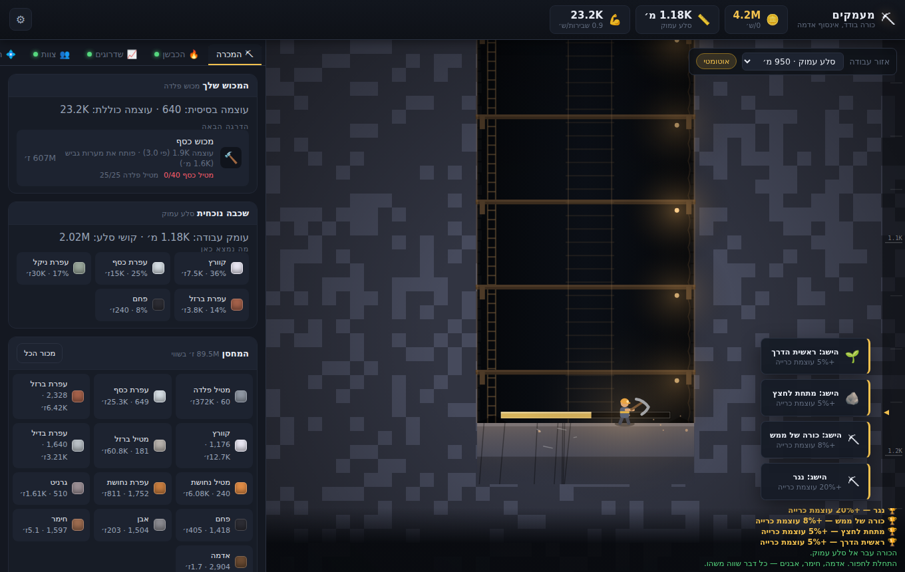

# מעמקים ⛏

משחק idle של כרייה. כורה אחד, אינסוף אדמה, והרבה מאוד מספרים שגדלים.

**להתחיל לשחק:** פשוט לפתוח את `index.html` בדפדפן. אין התקנה, אין build, אין תלויות.
(אם מעדיפים שרת מקומי: `npm start` ואז `http://localhost:8971`.)

המשחק נשמר אוטומטית בדפדפן כל 15 שניות, וממשיך לצבור משאבים גם כשסוגרים אותו.



---

## הלולאה

```
כורה  →  משאבים  →  כבשן (פי 3 ערך)  →  זהב  →  שדרוגים  →  כורה חזק יותר
                          ↓                                        ↓
                       מטילים  →  מכוש חדש  →  פורץ מחסום  →  שכבה עמוקה יותר
```

הדמות כורה תמיד, לבד. אתה לא לוחץ כדי לכרות — אתה מחליט מה לעשות עם מה שהיא מוצאת.

## מה יש במשחק

| מערכת | מה היא עושה |
|---|---|
| **11 שכבות עומק** | מאדמה עליונה ועד לב סלע האם. כל שכבה עם צבע, לוח שלל ורמת קושי משלה |
| **33 משאבים + 16 מטילים** | מאדמה (1 זהב) ועד רסיס סינגולריות (7.5 מיליארד) |
| **20 דרגות מכוש** | כל מכוש הוא היעד הבא, וכל שני מכושים פותחים שכבה חדשה |
| **כבשן** | התכה של עפרות למטילים ששווים פי 3. תאים מקבילים, דלק, מתכונים מסועפים |
| **צוות** | כורים שכירים שאפשר להציב בכל שכבה שנפתחה — כדי לאסוף חומרים משכבות שעברת |
| **חוזים** | יעדים קצרים עם תגמול שמן, נוצרים לפי מה שאתה מייצר עכשיו |
| **צמתים מיוחדים** | עורק עשיר, גאודה, תיבת אוצר, מרבץ ענק |
| **36 הישגים** | כל אחד נותן מכפיל קבוע שנשאר לנצח |
| **התמוטטות (prestige)** | מפוצצים את המכרה, מקבלים ליבות סלע, ומוציאים אותן ב‑14 כישרונות קבועים |
| **התקדמות לא‑מקוונת** | הכורה ממשיך לעבוד עד 48 שעות בזמן שאתה לא כאן |

## טיפים שלא ברורים מיד

- **המכוש הוא היעד.** כשהעומק נתקע, זה תמיד מחסום שדורש מכוש מדרגה מסוימת. הבאנר בפינה יגיד לך איזה.
- **תמיד להתיך לפני שמוכרים.** מטיל שווה בערך פי 3 מהעפרות שנשרפו בשבילו.
- **אפשר לחזור למעלה.** בורר "אזור עבודה" מחזיר את הכורה לשכבה רדודה — שם נמצא הפחם, וחומרים שהמתכונים עדיין צריכים.
- **צוות עובד ברקע.** תציב אותם בשכבות שאתה כבר לא כורה בהן.
- **Shift+לחיצה** על משאב = מכירה אוטומטית. Shift+לחיצה על מתכון = התכה אוטומטית.
- **התמוטטות היא אף פעם לא הפסד.** כל ליבה נותנת +2% עוצמה לתמיד, גם אם תוציא אותה בעץ הכישרונות.

---

## מבנה הקוד

וניל JavaScript, סקריפטים קלאסיים (בלי מודולים) כדי שהמשחק ירוץ ישירות מ‑`file://`.

```
index.html            טעינה בסדר קבוע
styles/main.css       ערכת נושא תת־קרקעית, RTL
src/
  util/               פורמט מספרים גדולים, RNG
  data/               כל התוכן והאיזון — משאבים, שכבות, מתכונים, שדרוגים, כישרונות
  systems/            לוגיקה טהורה: כרייה, כבשן, שוק, קניות, חוזים, prestige, offline
  render/             קנבס דו־ממדי: שכבות, כורה מונפש, חלקיקים, רעידות מסך
  ui/                 לוחות ה‑DOM, בקר ממשק
  main.js             bootstrap + לולאת פריימים (לוגיקה 20Hz, ציור לפי הדפדפן)
tools/                כלי פיתוח (ראה למטה)
```

`src/systems/` לא נוגע ב‑DOM או בקנבס בכלל — בזכות זה אותו קוד בדיוק רץ בסימולטור
האיזון ללא דפדפן.

## כלי פיתוח

```bash
node tools/validate.js            # בדיקת תקינות תוכן ואיזון
node tools/sim.js 6               # סימולציית 6 שעות עם שחקן אוטומטי
node tools/sim.js 12 --prestige   # כולל מחזורי התמוטטות
node tools/smoke.js 300           # מריץ את המשחק בדפדפן אמיתי ונכשל על כל שגיאה
```

### למה יש validator

`tools/validate.js` בודק שלושה דברים שאי אפשר לראות בעין בקבצי הנתונים,
ושכולם באמת נשברו במהלך הפיתוח:

1. **קיפאון התקדמות** — מכוש שדורש עפרה שנופלת רק *מעבר* למחסום שהוא עצמו פותח.
   הבדיקה מוכיחה שרשרת שלמה קדימה מדרגה 0 עד 19.
2. **חזרה כפויה אחורה** — מכוש שדורש חומר שלא נופל בשכבה שבה השחקן עומד כשהוא מחשל אותו.
3. **בריחת כלכלה** — שדרוג שמכפיל הכנסה ב‑(1+g) לרמה ועולה r^n גורם להכנסה לגדול
   כמו `gold^(ln(1+g)/ln r)`. אם סכום המעריכים על כל מסלול הכנסה מגיע ל‑1, הזהב
   מגיע לאינסוף בזמן סופי והמשחק אוכל את עצמו. הבדיקה מחשבת את הסכום הזה לכל מסלול,
   כולל **סולם המכושים** (שהוא בעצמו קו עוצמה) ואת **משוב העומק** — עומק מכפיל הכנסה
   *וגם* נקנה בעוצמה, וזה מעריך שלם שלא מופיע בשום טבלת שדרוגים.

התקציב הנוכחי:

```
depth feedback  0.10
mine→sell       0.53
mine→forge→sell 0.68
crew→forge→sell 0.69     (הסף הוא 1.00)
```
